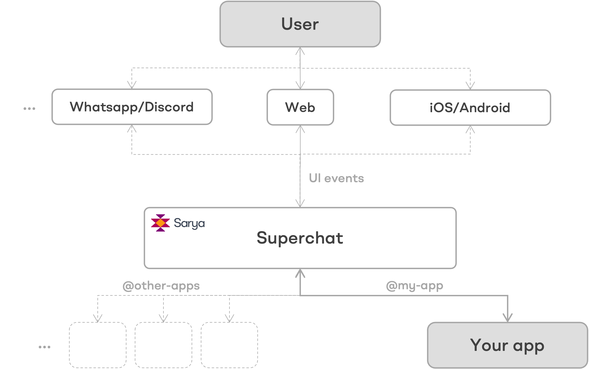

> github

> discord

## Sarya

**Sarya** is a generative UI framework to build, publish, and share AI powered apps. Sarya addresses the challenges involved in delivering AI-powered apps quickly to end users.

## Generative UI

**Generative UIs** are an upgrade in UI development, mirroring the rise of generative AI. Generative UI is simply where AI designs or improves user interfaces, in contrast to the more traditional fixed, and manual approach done by UI designers. These AI generated UIs are constantly evolving to meet individual needs, enhancing personalization and usability.

## Features
With Sarya:
- **100% control over your code**: Maintain your app logic and data on your infrastructure.
- **Bring your own LLM**: Flexibility in LLMs, use OpenAI or any open source alternative.
- **Generative UI**: Quickly generate rich UIs that integrate seamlessly with your AI logic.
- **Instant sharing**: Instantly share your customer-facing AI app.
- **Data & analytics**: Measure app's performance. Use data to finetune AI for better results.
- **Cross-platform**: Sarya currently is web-based. Mobile support for iOS and Android is underway.
- **Multimodal I/O**: Starting with text input, and expanding to voice, image, and video data inputs.

  
## How it works

  
- **UI Events**: Captures user inputs as UI evenet across multiple platforms.
- **Superchat (Sarya)**: Central hub that interprets UI events and routes to apps accordingly.
- **Apps**: Published third-party apps on Superchat, each with a public handler.

